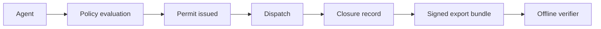

# Permit Specification

[](LICENSE)
[](https://github.com/keelapi/keel-permit/releases)

[](https://www.bestpractices.dev/projects/14125)

A pre-execution decision record for AI agent systems. A Permit records that an action was evaluated and decided, and, for dispatched allow executions, can be bound to the final provider or tool request. A Permit JSON object alone is not self-authenticating; verification is performed from signed export artifacts and the relevant public keys or key manifest. Those artifacts are verifiable without contacting the issuer when the verifier has the signed export artifacts and relevant public keys/key manifest.

This repository contains the wire-format specification, JSON schemas, and verification rules for **Permit v1**.

## Status

| | |
|---|---|
| Spec document version | 1.23.0 |
| Permit wire format | `v1` |
| Permit binding versions | `v1`-`v7` (`v6` frozen; `v7` additive/c7) |
| Closure record format | `closure_v1`, `closure_v2` |
| Chain entry hash format | `v1` |
| Reference implementation | keel-api (Keel-internal, not publicly readable) |
| Reference verifier | [keel-verifier](https://github.com/keelapi/keel-verifier) (`pip install keel-verifier`) |

## Why this exists

AI agents increasingly act faster than humans can review every step. Permit gives systems a standard way to record what was authorized before execution and to establish later, from signed offline-verifiable evidence, what was authorized and what request was bound to it. Verification does not establish that execution occurred or what its real-world effect was.



## What this specifies

- **Permit object** — fields, types, lifecycle, decision shapes.
- **Closure record** — the signed artifact that links a permit to its execution outcome (`closure_v1`, `closure_v2`).
- **Chain entry** — the record-hash algorithm and continuity rules for tamper-evident chains when entries are delivered through signed bundles or anchored checkpoints.
- **Audit export bundle** — the file format and manifest for offline-verifiable evidence packs.
- **Canonicalization** — JSON canonicalization rules for hashing.
- **Failure codes** — the normative taxonomy a verifier emits when integrity fails.

## What this does not specify

- A policy language or evaluation engine. Permits attest decisions; how decisions are reached is implementation-defined.
- A runtime, gateway, or proxy. Permits can be emitted by any system that wants to produce them.
- An identity or RBAC model. Subject and identity fields are open-ended.
- Live runtime API envelopes, network protocols, transport, or retrieval APIs. Permit v1 specifies audit-export artifacts and evidence semantics.
- Storage, indexing, or query semantics.

## Specifications

- [`spec/system-design-v1.md`](spec/system-design-v1.md) — Actors, actions, trust boundaries, and attack surface
- [`spec/permit-v1.md`](spec/permit-v1.md) — Permit object
- [`spec/permit-v2.md`](spec/permit-v2.md) — Permit v2 multi-party signature slots
- [`spec/permit-co-signature-v1.md`](spec/permit-co-signature-v1.md) — WebAuthn human co-signature claim and policy/key contracts
- [`spec/closure-v2.md`](spec/closure-v2.md) — Execution closure record
- [`spec/chain-entry.md`](spec/chain-entry.md) — Tamper-evident chain entry
- [`spec/audit-export-bundle.md`](spec/audit-export-bundle.md) — Evidence bundle format
- [`spec/canonical-json.md`](spec/canonical-json.md) — Canonicalization rules
- [`spec/failure-codes.md`](spec/failure-codes.md) — Verification failure taxonomy
- [`spec/permit-chain-v1.md`](spec/permit-chain-v1.md) — Delegated Permit Chain semantics
- [`spec/verifier-claims-v0.md`](spec/verifier-claims-v0.md) — Verifier claim model
- [`spec/verifier-pack-pinning-v0.md`](spec/verifier-pack-pinning-v0.md) — Pinned semantics for evidence packs
- [`spec/permit-revoked-event-v1.md`](spec/permit-revoked-event-v1.md) — Signed permit revocation event
- [`spec/key-status-event-v1.md`](spec/key-status-event-v1.md) — Signed key status event
- [`spec/key-status-manifest-v1.md`](spec/key-status-manifest-v1.md) — Signed account key-status manifest
- [`spec/key-status-completeness-v1.md`](spec/key-status-completeness-v1.md) — Key-status completeness verifier claim
- [`spec/dispatch-absence-after-revocation-v1.md`](spec/dispatch-absence-after-revocation-v1.md) — Scope-faithful absence adjudication after revocation
- [`spec/permit-to-work-v1.md`](spec/permit-to-work-v1.md) — Bounded Work authority, linked exact actions, payment-value events, and `work-chain.v1`
- [`spec/permit-to-work-v2.md`](spec/permit-to-work-v2.md) — Heterogeneous multi-principal Work, one customer-value pool, exact review, trusted provider facts, and derived summaries
- [`spec/permit-semantic-presentation-v1.md`](spec/permit-semantic-presentation-v1.md) — Trusted semantic selection and non-authorizing presentation
- [`spec/permit-fact-profiles-v1.md`](spec/permit-fact-profiles-v1.md) — Typed, privacy-aware authorization facts for Permit-to-X
- [`spec/permit-to-x-admission-v1.md`](spec/permit-to-x-admission-v1.md) — Twelve-gate admission test for specific Permit titles
- [`spec/permit-human-artifact-v1.md`](spec/permit-human-artifact-v1.md) — Human-first AI Permit-to-X rendering, deterministic summaries, and downloadable package trust rules
- [`spec/permit-universal-verification-v1.md`](spec/permit-universal-verification-v1.md) — Consequence-neutral exact claims, certified-boundary evidence, bounded use, privacy, and provider receipts
- [`spec/verifier-claims-v2.md`](spec/verifier-claims-v2.md) — Composable structured claims for specific Permit-to-X verification
- [`spec/transactional-cx-exact-action-contract-v1.md`](spec/transactional-cx-exact-action-contract-v1.md) — Exact Stripe and HubSpot customer-resolution action contracts

## Schemas

Most JSON Schema (Draft 2020-12) files in [`schemas/`](schemas/) are generated from the reference implementation's Pydantic models and then post-processed with public wire-format constraints. Regenerate with [`tools/export_schemas.py`](tools/export_schemas.py). Note that regeneration requires a checked-out copy of the Keel-internal `keel-api` repository, which is not publicly readable — third parties consume the committed schemas in [`schemas/`](schemas/) as published source rather than rebuilding them. The schemas are self-contained: verifying an artifact against them requires no Keel code. `schemas/closure-v2.schema.json`, `schemas/audit-export-manifest.schema.json`, and the four WebAuthn co-signature contract schemas are hand-maintained because they define repository-native protocol envelopes rather than generated reference-implementation models.

## Released artifacts

- [`claim_registry/`](claim_registry/) — stable verifier-claim registry artifacts.
- [`comparator_registry/`](comparator_registry/) — authority-envelope comparator semantics for Permit Chains.
- [`semantics/`](semantics/) — pinned semantic artifacts consumed by verifiers for export manifests, governance chains, closure records, checkpoints, workflows, Permit binding, and R4 budget-ledger claims.
- [`semantic_registry/`](semantic_registry/) — server-provenance selector contract for stable Permit semantics.
- [`fact_profiles/`](fact_profiles/) — typed authorization-fact schemas and disclosure rules for specific Permit semantics.
- [`presentation_registry/`](presentation_registry/) — non-authorizing titles, definitions, controlled leading fields, evidence emphasis, and fallbacks.
- [`consequence_registry/`](consequence_registry/) — exact consequential tool mappings that generate additive semantic and presentation registry releases.
- [`artifact-manifests/permit-to-x-v1.json`](artifact-manifests/permit-to-x-v1.json) — exact-byte hashes for generated downstream consumers.

## Capability Inventory

| Capability | Public contract |
|---|---|
| Permit binding canonicalization | `v1`-`v4` use the legacy Keel profile; `v5`-`v7` use RFC 8785 / JCS. |
| Frozen v6 boundary | `v6` remains byte-stable and keeps its exact resource-attributes contract. |
| Additive v7/c7 binding | `v7` signs the v6 field set plus `authority_chain_digest`, `quota_reservation_id`, `subject_id`, `subject_type`, `account_id`, and `org_id`. |
| Permit v2 slot key lookup | For `v7` and later, account and registry-partition selection comes from signed permit bytes; unsigned manifest override is rejected. |
| R4 ledger claims | `quota.reservation_linkage.v1` and `budget.partition_ledger.v1` define budget-allocation ledger evidence; unsigned quota linkage grades are anchor-contingent. |
| Permit co-signature contract | `permit.co_signature.v1` verifies WebAuthn ES256 or EdDSA assertions bound by challenge to a Permit canonical hash; assurance and identity enforcement remain default-off. |
| Universal exact-action contract | `keel.permit_exact/v2`, semantic binding v2, fact-profile registry v2, and `verifier-claims.v2` define consequence-neutral structured verification without changing historical v0/v1 adjudication. This repository defines the contract; a runtime or verifier claims support only after its own compatible release. |
| Certified-boundary evidence | Adapter certification, deployment assurance, and runtime enforcement proof are separate digest-bound artifacts with expiry and revocation. A connector label alone does not establish enforcement. |
| Outcome evidence | Provider rejection, acceptance, and completion are separate claims. Provider completion remains a provider assertion unless independent outcome evidence is separately verified. |
| Reference verifier status | The reference verifier verifies `v7` permit decisions and rejects unsigned account-selector drift. |
| Bounded Work contract | Strict payment-only Work schemas and four claim contracts are published contract-first; coordinated API producer and public-verifier support are separate release gates. |
| Permit-to-X presentation | Specific titles require a trusted semantic selector result; presentation artifacts cannot change authorization or verifier verdicts. |
| Consequence registry | Exact certified tool names can add consequence-specific selectors, typed fact profiles, and human titles without rewriting historical registries; caller labels and titles are never selector inputs. |
| Permit-to-X fact profiles | Semantic registries can bind an eligible semantic to a typed fact profile; payment, refund, delegation, text-generation, five database consequences, three Payment & Ledger consequences, and five Transactional CX consequences now have schema-pinned exact facts. |

## Examples

Reference artifacts in [`examples/`](examples/) — schema-valid illustrative permits, closure records, chain entries, and an illustrative audit export bundle. Unless an example is explicitly marked as a cryptographically verifiable reference bundle, hashes, signatures, and key identifiers are placeholders.

## Control framework mappings

[`mappings/control-frameworks.schema-mapping.json`](mappings/control-frameworks.schema-mapping.json) — machine-readable mapping from Permit v1 wire-format fields and audit-export-bundle artifacts to specific control IDs across 14 frameworks (CCPA §1798.105, CPPA ADMT regulations, EU AI Act, GDPR, AICPA SOC 2, NIST AI RMF, ISO/IEC 42001:2023, OWASP LLM Top 10 2025, MITRE ATLAS, OWASP API Security Top 10 2023, OWASP ASVS v5.0.0, FedRAMP / NIST SP 800-53 Rev 5, CIS Controls v8.1, PCI DSS v4.0.1).

See [`mappings/README.md`](mappings/README.md) for status, scope, evidence-support disclaimers, schema shape, and explicit non-mappings documenting controls Keel does not address.

## Conformance test vectors

[`test-vectors/`](test-vectors/) — a versioned conformance fixture set that any verifier (Keel's reference verifier or independent third-party implementations) can be tested against. Each populated fixture has an `expected.json` defining the required outcome; a verifier that disagrees on a populated fixture is non-conforming.

The suite is not uniformly populated. The executable corpora — `permit_co_signature/v1` and `v2`, `verifier_claims/v0`, `semantics/`, and `vectors/cat-08-permit-chains/` — carry real bytes and run in CI. The byte-level scaffolds under `vectors/cat-01-baseline/` and `vectors/cat-02-tamper-chain/` still carry **placeholder hashes and signatures** pending the deterministic fixture generator, and the `keel-conformance` runner CLI is planned rather than shipped. See [`test-vectors/README.md`](test-vectors/README.md) for per-corpus status before citing a conformance result.

Current conformance artifacts include the pinned-semantics golden corpus in [`test-vectors/verifier_claims/`](test-vectors/verifier_claims/), semantic-artifact conformance records in [`test-vectors/semantics/`](test-vectors/semantics/), and self-contained Permit Chain semantic vectors under [`test-vectors/vectors/cat-08-permit-chains/`](test-vectors/vectors/cat-08-permit-chains/). See [`test-vectors/README.md`](test-vectors/README.md) and [`test-vectors/CONFORMANCE.md`](test-vectors/CONFORMANCE.md).

The WebAuthn co-signature protocol corpus and its dependency-free executable reference verifier are under [`test-vectors/permit_co_signature/v1/`](test-vectors/permit_co_signature/v1/).

## Versioning

Three orthogonal version axes:

- **Permit wire format** (`v1`): the on-the-wire structure of a Permit object. Bumping this is a breaking change.
- **Closure record format** (`closure_v1`, `closure_v2`): the signed envelope for execution closure. New formats are added; old formats remain valid indefinitely.
- **Chain entry hash format** (`v1`): the input string layout passed to SHA-256 to produce a record hash. Bumping this is a breaking change.

This **specification document** uses semver independently of the wire formats — a 1.0.0 → 1.1.0 spec release may clarify normative language without changing any byte-level format.

## Conformance

A Permit emitter conforms to this specification if and only if:

1. Every emitted Permit object validates against `schemas/permit-v1.schema.json`.
2. Every closure record emitted in `closure_v2` form validates against `schemas/closure-v2.schema.json` and satisfies the digest-presence matrix in [`spec/closure-v2.md`](spec/closure-v2.md) §3.
3. Every chain entry conforms to the record-hash algorithm in [`spec/chain-entry.md`](spec/chain-entry.md).
4. Every audit export bundle validates against `schemas/audit-export-bundle.schema.json` and ships a companion signature manifest as defined in [`spec/audit-export-bundle.md`](spec/audit-export-bundle.md).

A Permit verifier conforms if it implements the failure codes in [`spec/failure-codes.md`](spec/failure-codes.md) and rejects any artifact that violates the rules in the corresponding spec document.

## Stability

The wire formats and hash algorithms in this spec are stable. A breaking change to any wire format requires a new format version (`v2`, `closure_v3`, etc.); the previous version remains valid indefinitely so that historical artifacts continue to verify. See [`CHANGELOG.md`](CHANGELOG.md).

## Releases and verification

Each tagged release publishes three assets:

| Asset | What it is |
|---|---|
| `keel-permit-<version>.tar.gz` | The published specification distribution. Development tooling is excluded. Not all of it is normative — see below. |
| `release-manifest.json` | SHA-256 of the bundle, plus a per-file digest for all 794 artifacts, the source commit, and the command to reproduce the bundle. |
| `SHA256SUMS` | `sha256sum`-compatible digests of the published assets. |

### What is in the distribution

`release-manifest.json` classifies every member, because "shipped in the release"
and "normative" are not the same thing:

| Class | Paths |
|---|---|
| **Normative** | `spec/`, `schemas/`, the registries, `semantics/`, `artifact-manifests/` |
| **Conformance artifacts** | `test-vectors/` — test material, not specification text |
| **Illustrative** | `examples/` — reference artifacts illustrating the wire formats; hashes and signatures are placeholders unless marked otherwise |
| **Draft evidence support** | `mappings/` — control-framework mappings, version `0.2.0-draft`, explicitly not a compliance certification |
| **Project documentation** | README, CHANGELOG, CONTRIBUTING, GOVERNANCE, SECURITY, LICENSE |

### Verify a release

Two independent checks. Use either; using both is stronger.

**Rebuild it yourself.** The bundle is produced with `git archive`, which is
byte-deterministic for a given tree, so you do not have to trust the publisher:

```sh
git clone https://github.com/keelapi/keel-permit && cd keel-permit
git archive --prefix=keel-permit-1.23.0/ --format=tar.gz v1.23.0 | sha256sum
# compare with .bundle.sha256 in release-manifest.json
```

If the digest matches, the published bundle is exactly the tagged tree. This is
the stronger check: a signature attests who built an artifact, whereas rebuilding
attests what is in it.

**Check the build provenance.** Releases carry a Sigstore-backed GitHub artifact
attestation binding the bundle to the workflow and commit that produced it:

```sh
gh attestation verify keel-permit-1.23.0.tar.gz -R keelapi/keel-permit
```

### What these checks do and do not establish

They establish that the bundle matches the tagged source and was built by the
declared workflow. They do not establish that the specification is correct, that
an implementation conforms, or that any Permit artifact you hold is valid — that
is what the conformance corpus and a verifier are for.

The release manifest is currently **unsigned** and records `"signed": false`
rather than implying an assurance it does not carry. Maintainer-signed tags and
a Keel-native signed release manifest are separate, additive trust paths; see
[`GOVERNANCE.md`](GOVERNANCE.md).

## Feedback and bug reports

- **Bugs, spec ambiguities, and schema problems** — open an issue at
  [github.com/keelapi/keel-permit/issues](https://github.com/keelapi/keel-permit/issues).
  Useful reports name the affected spec section, schema, or fixture, and state
  the verifier behaviour you expected.
- **Questions and proposals** — use
  [GitHub Discussions](https://github.com/keelapi/keel-permit/discussions).
- **Contributions** — see [`CONTRIBUTING.md`](CONTRIBUTING.md).
- **Security vulnerabilities** — do **not** open a public issue. Follow
  [`SECURITY.md`](SECURITY.md) and report privately to `security@keelapi.com`.

## Project Stewardship

Permit Spec is maintained by Keel API, Inc.

Governance, roles, and access are documented in [`GOVERNANCE.md`](GOVERNANCE.md).

Maintainer with write and administrative access to this repository:
[@sftimeless](https://github.com/sftimeless). Changes reach `main` only through
pull requests that pass the `repo-integrity` check; direct commits to `main` are
blocked for all users including administrators.

The OpenSSF badge above records an OSPS Baseline Level 1 **self-assessment**
published on the OpenSSF Best Practices site. It is a self-attestation, not an
independent audit, certification, or third-party assessment.

- Website: https://keelapi.com
- Reference implementation: keel-api (Keel-internal, not publicly readable)
- Reference verifier: https://github.com/keelapi/keel-verifier

## License

Apache License 2.0. See [`LICENSE`](LICENSE).
