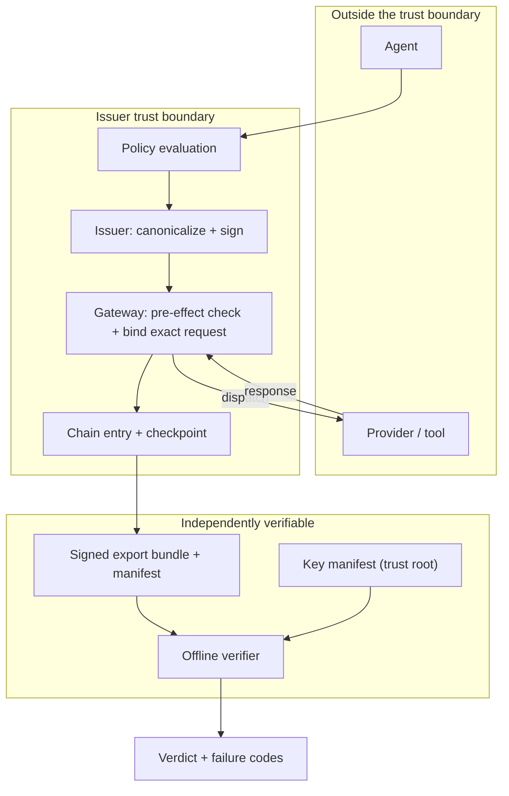

# System Design: Actors, Actions, and Trust Boundaries

This document consolidates, in one place, every actor the Permit specification
recognises, every action that produces or consumes a signed artifact, and the
trust boundaries a verifier depends on. It is descriptive, not normative: each
statement here is governed by the specification document cited beside it. Where
this document and a normative specification disagree, the specification wins.

Its purpose is to let a reader evaluate the system as a whole without reading
all 40-plus specification documents first, and to make the boundary between
"cryptographically established" and "asserted" legible at a glance.

## 1. Actors

An actor is any party that produces, transforms, transports, or evaluates a
Permit artifact. Actors are roles, not necessarily separate systems: one
deployment may collapse several into one process, and the specification does not
require otherwise.

| Actor | Role | Trusted for | Explicitly not trusted for |
|---|---|---|---|
| **Agent** | The AI system requesting an action. | Nothing. It is the subject of authorization, not a source of authority. | Its own labels, titles, or claims about what it is doing. Caller labels are never selector inputs. |
| **Policy evaluation** | Decides allow, deny, or require-review. | Producing a decision. | Nothing else. The specification deliberately does not define a policy language; how a decision is reached is implementation-defined. |
| **Issuer** | Freezes the decision into a Permit, canonicalizes it, and signs. | Binding a decision to canonical bytes at a point in time. | Establishing that execution occurred, or that its own configuration was what it claims. |
| **Gateway / enforcement boundary** | Sits between the agent and the provider, performs the pre-effect check, and binds the exact outbound request. | Producing the dispatch binding and runtime enforcement proof. | Self-declaring that it governed a request. Writing `enforced_by_keel` is not evidence. |
| **Adapter** | Translates a governed action into a provider-specific request shape. | Nothing on its own. | A connector label alone does not establish enforcement. |
| **Provider / tool** | The external system that actually performs the effect. | Nothing. It is outside the trust boundary entirely. | Provider completion remains a provider assertion unless independent outcome evidence is separately verified. |
| **Human co-signer** | Approves or witnesses via a WebAuthn credential. | Having signed a challenge bound to one Permit's canonical hash. | Hardware binding, independently rooted identity, notarization, witnessing, or third-party independence. Freshness and single use are also not established. |
| **Key custodian** | Publishes the key manifest that maps `key_id` to public keys, purposes, and validity windows. | Being the trust root. Everything else resolves through it. | Nothing beyond key resolution. If this is compromised, every downstream claim is compromised. |
| **Verifier** | Re-derives hashes, checks signatures, walks chains, and emits verdicts. | Adjudicating supplied evidence against the specification. | Knowing anything outside the supplied evidence window. |
| **Relying party / auditor** | Consumes the verifier's verdict. | Deciding what the verdict means for their purposes. | — |

## 2. Actions

Each action either produces a signed artifact or consumes one. Actions marked
**signed** produce bytes covered by a signature; actions marked *unsigned* do
not and cannot be relied on alone.

| # | Action | Actor | Produces | Governed by |
|---|---|---|---|---|
| 1 | Evaluate policy | Policy evaluation | A decision (*unsigned*) | Implementation-defined |
| 2 | Issue Permit | Issuer | Permit object, **signed** | [`permit-v1.md`](permit-v1.md), [`permit-v2.md`](permit-v2.md) |
| 3 | Canonicalize | Issuer | Canonical bytes for hashing | [`canonical-json.md`](canonical-json.md) |
| 4 | Request human co-signature | Gateway | WebAuthn assertion, **signed** | [`permit-co-signature-v1.md`](permit-co-signature-v1.md) |
| 5 | Bind exact request at dispatch | Gateway | Dispatch binding digest, **signed** into the Permit | [`permit-v1.md`](permit-v1.md) §2.2 |
| 6 | Dispatch to provider | Gateway | — (leaves the trust boundary) | — |
| 7 | Record closure | Issuer | Closure record, **signed** | [`closure-v2.md`](closure-v2.md) |
| 8 | Append chain entry | Issuer | Chain entry with record hash | [`chain-entry.md`](chain-entry.md) |
| 9 | Anchor checkpoint | Issuer | Checkpoint, **signed** | [`checkpoint-scope-state-v1.md`](checkpoint-scope-state-v1.md) |
| 10 | Revoke a Permit | Issuer | Revocation event, **signed** | [`permit-revoked-event-v1.md`](permit-revoked-event-v1.md) |
| 11 | Change key status | Key custodian | Key status event and manifest, **signed** | [`key-status-event-v1.md`](key-status-event-v1.md), [`key-status-manifest-v1.md`](key-status-manifest-v1.md) |
| 12 | Assemble export bundle | Issuer | Bundle plus signed manifest sidecar | [`audit-export-bundle.md`](audit-export-bundle.md) |
| 13 | Verify offline | Verifier | Verdict plus failure codes | [`failure-codes.md`](failure-codes.md), [`verifier-claims-v0.md`](verifier-claims-v0.md) |
| 14 | Present to a human | Any | Non-authorizing rendering | [`permit-semantic-presentation-v1.md`](permit-semantic-presentation-v1.md), [`permit-human-artifact-v1.md`](permit-human-artifact-v1.md) |

Action 14 cannot change authorization or a verifier verdict. Presentation is
strictly downstream of adjudication.

## 3. Flow

The dashed conceptual line that matters is between `inside` and
`independent`: everything in the issuer boundary is asserted by one party, and
becomes independently checkable only once it is inside a signed bundle whose
keys resolve through the manifest.

## 4. Trust boundaries

**The trust root is the key manifest.** Every signature check terminates in a
`key_id` resolved against the issuer's key manifest, scoped to a purpose and to
a validity window containing the artifact's `signed_at`
([`audit-export-bundle.md`](audit-export-bundle.md) §5–6). A verifier that
cannot resolve the key returns `insufficient_evidence` rather than a pass.
Compromise of the manifest compromises everything downstream; no artifact in
this system is self-authenticating without it.

**Verification is window-scoped.** A bundle that passes every check is
cryptographically intact *for the export window it contains*. It does not
establish complete lifetime history unless the first and last chain entries are
tied to anchored checkpoints or another documented continuity proof
([`audit-export-bundle.md`](audit-export-bundle.md) §6,
[`chain-entry.md`](chain-entry.md) §5).

**Authorization is not execution.** The system establishes what was authorized
and what request was bound to that authorization. It does not establish that the
request executed, that it succeeded, or what its real-world effect was. Closure
digests specifically do not constitute proof of TCP-level delivery, network
reachability, or end-user reading ([`closure-v2.md`](closure-v2.md) §8).

**Absence claims are bounded.** The verifier does not claim omniscient proof
that no execution occurred. Absence adjudication is scoped to a declared
predicate over supplied evidence
([`dispatch-absence-after-revocation-v1.md`](dispatch-absence-after-revocation-v1.md)).

**Certification is first-party.** Adapter certifications, deployment assurances,
and runtime enforcement proofs are signed artifacts issued by Keel. They are not
third-party accreditation
([`permit-universal-verification-v1.md`](permit-universal-verification-v1.md) §6).

## 5. What an attacker would target

Ordered by consequence, with the mitigation the specification relies on.

| Target | Consequence if successful | Mitigation |
|---|---|---|
| Key manifest / signing keys | Total. Arbitrary forged evidence that verifies. | Purpose-scoped keys, validity windows, signed key-status events, revocation. This remains the highest-value target and is not mitigated by anything inside an artifact. |
| Canonicalization divergence | Two implementations disagree on bytes, so a hash check passes or fails incorrectly. | Frozen per-version canonical profiles, `binding_version` recorded on every artifact, cross-language byte-equivalence required via shared vectors ([`canonical-json.md`](canonical-json.md) §1, §9). |
| Chain entry tampering | Rewritten history. | Record hash incorporates the previous entry's hash, so any modification invalidates every subsequent entry ([`chain-entry.md`](chain-entry.md)). |
| Approved-request vs executed-request divergence | The agent gets authorization for one request and sends another. | Dispatch-time equality check between bound and sent bytes; `CLOSURE_DISPATCH_DIGEST_MISMATCH` is the canonical failure signature ([`failure-codes.md`](failure-codes.md)). |
| Cross-Permit assertion replay | A valid human approval is reused against a different Permit. | The WebAuthn challenge is the Permit canonical hash, plus a required binding comparison against an independently verified target context ([`permit-co-signature-v1.md`](permit-co-signature-v1.md) §5). |
| Partial-window export | A true but misleading evidence pack that omits inconvenient entries. | Window-scoping is explicit and continuity outside the window is not claimed; anchored checkpoints are the remedy. |
| Presentation manipulation | A human is shown a title that misrepresents the action. | Titles derive from trusted semantic selection; caller labels are never selector inputs, and presentation cannot alter a verdict. |

Section 5 is a structured attack-surface summary, not a completed security
assessment. A full assessment covering deployment topology, key custody
operations, and issuer-side compromise scenarios has not yet been published.

## 6. Related documents

- [`failure-codes.md`](failure-codes.md) — the normative failure taxonomy, and the closest thing to a per-artifact threat enumeration.
- [`../test-vectors/CONFORMANCE.md`](../test-vectors/CONFORMANCE.md) — what a conforming verifier must emit.
- [`../SECURITY.md`](../SECURITY.md) — vulnerability reporting and disclosure.
